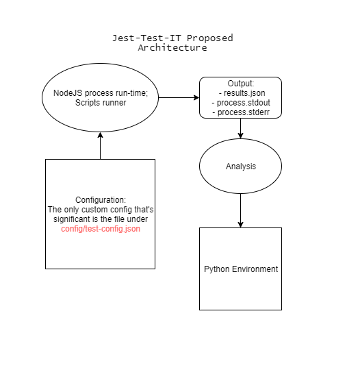

# `Jest-Test-IT` The open-custom testing with Jest and Puppeteer 
This framework aims to initiate automation when it comes to abstracting test cases 
that span from front-end, back-end, and an end to end evaluation.

This provides a starting point for a framework agnostic testing unit. 
So no matter what `client-side` or `server-side` library a project is utilizing, as long as its expected operation and output remains the same, this cause will always be useful.


## Proposed Architecture of this project

The project's future direction is to analyze or process results from given test cases. Inline with such purpose, series of reiteration is expected for data formatting and project setup/configuration. Plus, to ensure quality to that procedure, we've chosen the advantages of what `python` environment can give.




## Project Overview

- All test cases should be under the directory named `tests`.
    - Tests cases for front-end, back-end, and end-to-end should be place under their respective folder with the given name.
- The file `demo.test.js` and `demo.js` illustrates coded test cases that accepts ES6 syntax.
- The files under `src` folder are related to scripts useful to run this project and execute.
- As of present, users who wishes to run this project only modify the config file `test-config.json`, under `config` folder.
    - See below instructions for the available configurations.
- The project is currently consuming `Jest` and `puppeteer` advantages when it comes to testing and automation, respectively.
    - The project's already in an efficient `puppeteer` config spawning only one headless browser at test's run-time 
- Take note that this project to this day is solely for local use only, please do not expose the `NodeJS` scripts to any third party program to avoid security risks.

## Project Setup
- `Note:` OS support for now is only available to `Windows machine`
- Please secure `NodeJS` version 12+ or install latest `yarn`
- Invoke `npm install` or `yarn` (assuming you're in the directory)
- If there are no conflicts or errors received after installation, feel free to invoke:
    - `npm run start` or `yarn run start`
- See magic at console or view generated file `results.json`


## Configuration (file @ config/test-config.json)

- Below are the default values to this day

```json
{
    "tests": ["front-end"],
    "url": "https://www.google.com/",
    "verbose": true
}

```


- Key: `tests`
    - type: <array-of-strings>
    - accepted string values: 
        - `front-end`
        - `back-end`
        - `end-to-end`
    - `front-end`: Isolated for test cases related to UI only
    - `back-end`: Isolated for test cases related to the server or API testing
    - `end-to-end`: Isolated for test cases related to web app operations, spanning from front-end to back-end (e.g.,Submitting a form via click event and expecting a response from a server)
- Key: `url`
    - type: <string>
    - accepted string values:  
        - <any>
    - requisite(s): {lease provide a valid and desired web URL to test

- Key: `verbose`
    - type: <boolean>
    - accepted values:
        - `true` or `false`
    - description: When set to true, this enable logging of more infos on your `process.stdout`


## Creating custom test cases

- Currently, the project has a neat demo test at `front-end` 
    - The demo introduces a test on the default URL value (`https://www.google.com/`)
    - It tests the Google Search homepage whether the `Search Button` exists for users
- For syntax in creating custom test cases, read more at 


## Goals
- Increasing efficiency in setup (`puppeteer`, `Jest`, `webpack`)
- Transfer `jest-puppeteer.config.js` file under `config` directory
- Support for `python` environment
- Setup for test results processing